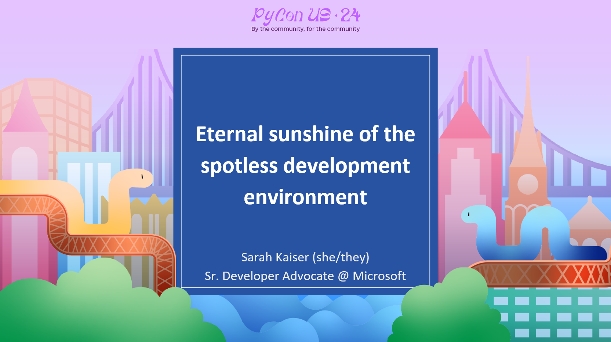

# 
[Schedule](https://us.pycon.org/2024/schedule/presentation/123/) | [Slides](slides.pdf) | [Demo](demo.ipynb) | [Title inspo: Eloisa To Abelard by Alexander Pope](https://gutenberg.org/cache/epub/9413/pg9413-images.html#link2H_4_0051:~:text=Eternal%20sunshine%20of%20the%20spotless%20mind!)

> Try out Dev Containers in Codespaces with this template! [github.com/crazy4pi314/conda-devcontainer-demo](https://github.com/crazy4pi314/conda-devcontainer-demo)

“It says the package is not installed?” is a common refrain when working on software projects, especially in Python. Creating and configuring reproducible environments is a major part of modern software development and has led to the popularity of tools like Docker to specify where and how code runs. Development (Dev) Container are an open specification that extends Docker images to make it easy to configure not only the where the code runs, but also the developer workspace in your preferred editors or toolchains like VS Code, PyCharm, or DevPod. Setting up Dev Containers for your projects can reduce maintainer overhead of OSS projects, bootstrap contributors, and make running events like workshops or sprints go more smoothly.

In this talk, we will briefly cover why setting up container infrastructure can be useful for isolating your project environments and dig into how you can extend that with Dev Containers to configure a complete development experience using VS Code. We will look at two common OSS project situations, onboarding and workshops, to see how workflows for using Dev Containers and other supporting tools make things easier. No container experience required, brief familiarity with VS Code is helpful, but not necessary.

### Learn more about how Microsoft ❤️ Python: [https://aka.ms/Pycon24](https://aka.ms/Pycon24)

--- 

### Speaker Profile:

Sarah has spent most of her career developing technology in the lab, from virtual reality hardware to satellites. She got her PhD in Physics by starting plasma fires with lasers, Python, and Jupyter Notebooks. She has also written tech books for folks of all ages, including ABCs of Engineering and Learn Quantum Computing with Python and Q#.  As a Cloud Developer Advocate for Python at Microsoft and a Python Software Foundation Fellow, she finds all kinds of new ways to build and break OSS tools for data science and machine learning. When not at her split ergo keyboard, she loves boating in the Seattle area, laser cutting everything, and playing with her German Shepard, Chewie.

[sckaiser.com](https://sckaiser.com) | [Mastodon](https://mathstodon.xyz/@crazy4pi314) | [GitHub](https://github.com/crazy4pi314)

### Bonus

This talk repo is based on a [template repository](https://github.com/crazy4pi314/conda-devcontainer-demo?WT.mc_id=python-91783-sarahakaiser) that can be used to start with a minimal [Dev Container](https://containers.dev/) setup that provides [conda](https://github.com/conda/conda) and [mamba](https://github.com/mamba-org/mamba) for setting up Python environments.
You can find a blog post on how to use it on [Dev.to](https://dev.to/crazy4pi314/how-to-get-the-best-conda-environment-experience-in-codespaces-4na9?WT.mc_id=python-91783-sarahakaiser).
